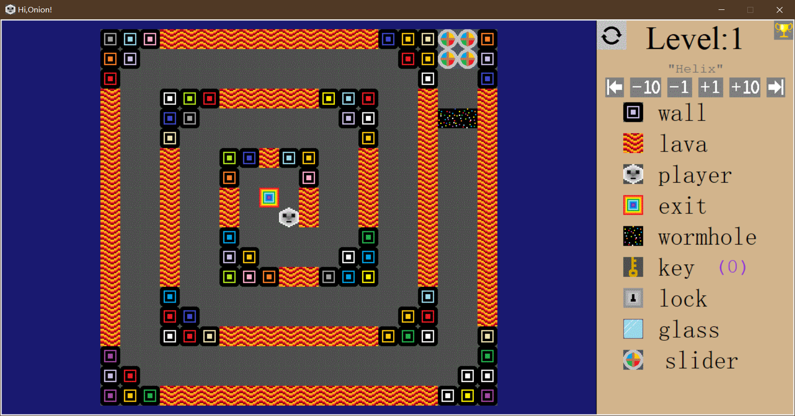
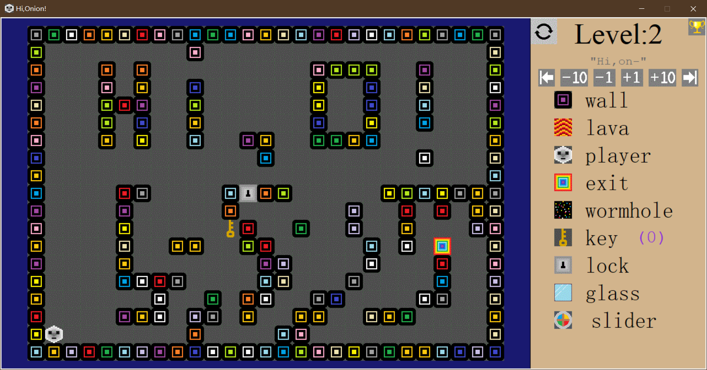
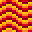
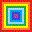

# HiOnion

I made this game for practice in 2017 when I was in middle school.

At first, it was a game in windows's cmd, later I learned Tkinter(A python official GUI package) and I decided to make a GUI version.  

Hope you like it.





## Environment

**Python3**, no other non-official packages is needed. 

Runs on **Windows, Mac OS, Linux**.

## How to start

Double click on *HiOnion.pyw*.

**Or** 

Open your terminal and type:

```bash
python3 HiOnion.pyw
```

## Gamerule

The game rule is simple: It's kind like of a mixture of labyrinth&sokoban, but unlike a sokoban, once you start to move, you won't stop until a wall, or something else stops you.

> Use WSAD or Arrows on your keyboard to move.

-  [wall] You can stop here safely. 

-  [lava] Do not try to swim in lava!

-  [player] You.

-  [exit] Reach here and you win.

-  [wormhole] Wormholes come out in pair. If you enter one wormhole, you will go out from the other and continue to move in the same direction.

-  [key] You won't stop when there is a key in you way, but you can get it if you go pass.

-  [lock] Crash into it and a key will be consumed(if you have), then you will find some blocks changed.  

-  [glass] Stops you and then it turns into brokenglass.

-  [brokenglass] Won't stop you, just the remnant of a piece of glass.

-  [slider] A slider is something you can push step by step.

## Levels

Most levels are designed by myself, but these two levels are designed by my friend [godtoogod · GitHub](https://github.com/godtoogod):

- Level 7: Have a try.

- Level 13: Triple jump?

There are 16 levels in total for now (Training levels excluded) . 

## Tips

- Level names could be hints. 

- Some traits demostrated in former levels might be helpful to later levels.

- You can make you own levels by editing *maps.txt*.
